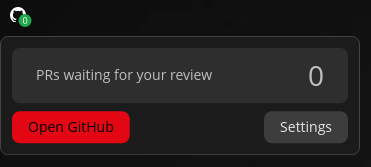
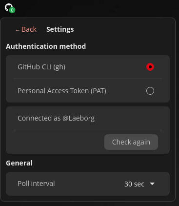

# cosmic-applet-github-status

A COSMIC panel applet that shows the number of GitHub PRs waiting for your review.

[](https://github.com/Laeborg/cosmic-applet-github-status)

## Features

- Displays a count of open PRs where you are a requested reviewer and have not yet approved
- Click the applet to open a popup with the current count
- Click **Open GitHub** to go directly to your GitHub review queue
- **Settings** — configure authentication and poll interval:
  - **GitHub CLI** — uses `gh` CLI, no token needed; shows connected account
  - **Personal Access Token (PAT)** — uses the GitHub REST API via `curl`
  - **Poll interval** — choose between 30 sec, 1 min, 2 min, 5 min, 10 min, or 30 min

## Screenshots

| Panel icon | Popup | Settings |
|:---:|:---:|:---:|
|  |  |  |

## Requirements

- [COSMIC desktop environment](https://github.com/pop-os/cosmic-epoch)

**GitHub CLI mode (default):**
- [GitHub CLI (`gh`)](https://cli.github.com/) — authenticated via `gh auth login`

**PAT mode:**
- `curl` — available by default on most Linux systems
- A GitHub Personal Access Token with `repo` scope

## Quick install

```sh
bash <(curl -fsSL https://raw.githubusercontent.com/Laeborg/cosmic-applet-github-status/main/install.sh)
```

## Building from source

### 1. Build

```sh
cargo build --release
```

### 2. Install files

```sh
sudo just install
```

To uninstall:

```sh
sudo just uninstall
```

### 3. Add to panel

Right-click the COSMIC panel → **Edit panel** → click **+** → select **GitHub Status**.

### 4. Authenticate

Click the applet → **Settings** → choose your authentication method:

- **GitHub CLI**: run `gh auth login` in a terminal first, then click **Check again** in settings to verify
- **PAT**: paste your Personal Access Token and click **Save**

## Development

- `cargo build` — debug build
- `cargo build --release` — release build
- `cargo run --release` — run standalone (outside the panel, for testing)
- `cargo clippy` — lint

## Links

- [libcosmic API documentation](https://pop-os.github.io/libcosmic/cosmic/)
- [libcosmic book](https://pop-os.github.io/libcosmic-book/)
- [GitHub CLI](https://cli.github.com/)
